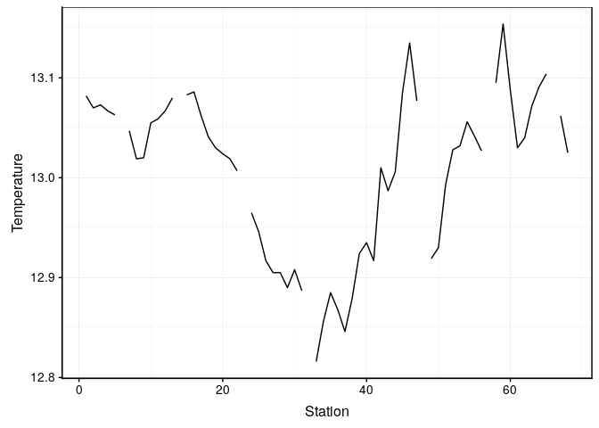

Analyse des mesures physico-chimiques lors du transect Nice-Calvi
================

## Contexte

Des scientifiques ont réalisé des mesures physico-chimiques lors d’un
transect entre Nice et Calvi.

``` r
(mp <- read("data/marphy2.rds"))
```

    ## # A tibble: 68 x 5
    ##    Temperature Salinity Fluorescence Density Station
    ##          <dbl>    <dbl>        <dbl>   <dbl>   <int>
    ##  1        13.1     38.2        0.958    28.8       1
    ##  2        13.1     38.2        0.931    NA         2
    ##  3        13.1     38.2        0.844    28.8       3
    ##  4        13.1     38.2       NA        28.8       4
    ##  5        13.1     38.1        0.742    28.8       5
    ##  6        NA       38.1        0.874    28.8       6
    ##  7        13.0     38.1       NA        28.8       7
    ##  8        13.0     38.1        0.974    28.8       8
    ##  9        13.0     38.2       NA        28.9       9
    ## 10        13.1     38.2        0.945    28.9      10
    ## # … with 58 more rows

Lors de la prise des mesures, des problèmes techniques sont survenus.
Les scientifques ont perdu des données. Utilisez les techniques de
régularisation des séries afin d’aider les scientifiques.

Les scientifiques ont besoin le plus rapidement possible des données de
température.

``` r
chart(mp, Temperature ~ Station) +
  geom_line()
```

<!-- -->

Dans un bref rapport, analysez les données régularisées. Testez
différents outils de régularisation afin de trouver l’outil le plus
adapté à tes données.
